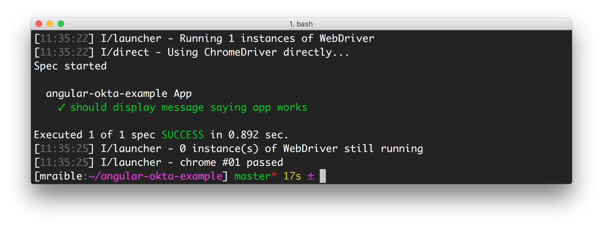
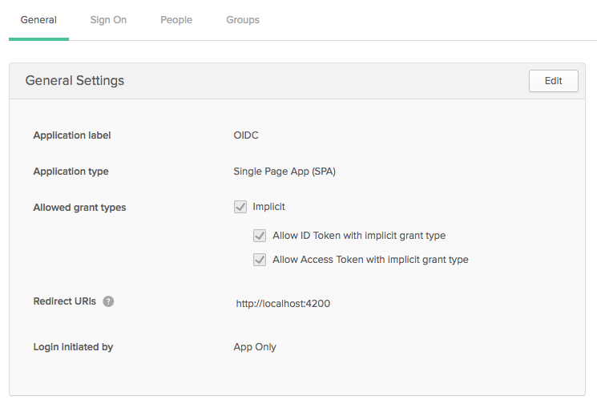
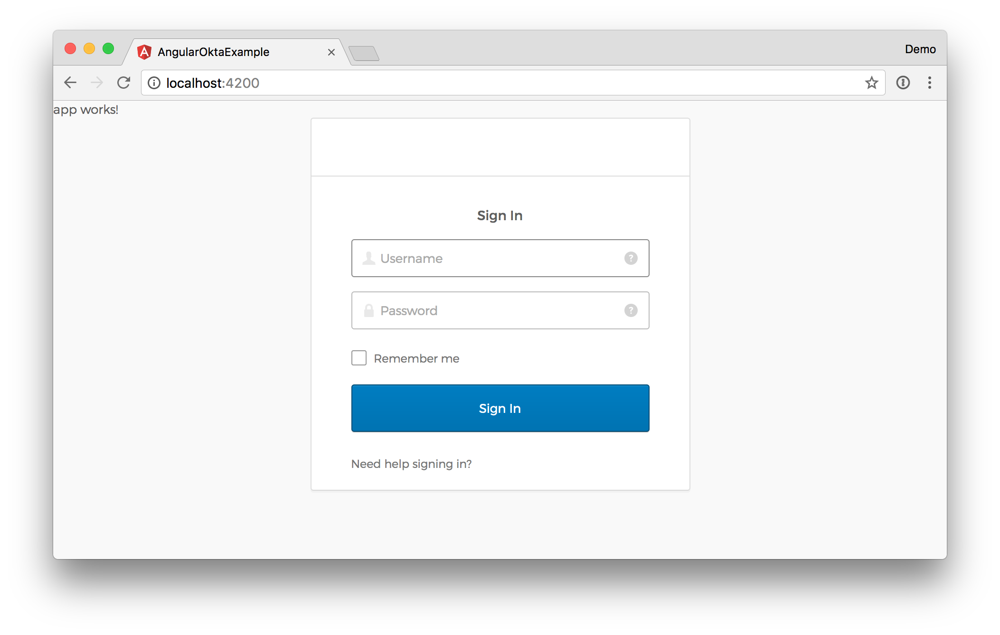

# Build an Angular Application with User Authentication in Minutes

In this article, I’ll show you a quick way to get started with Angular, and add user authentication with [Okta's Sign-In Widget](http://developer.okta.com/code/javascript/okta_sign-in_widget). If you’re just getting started with Angular, you might want to read my [Angular tutorial](http://gist.asciidoctor.org/?github-mraible/ng-demo//README.adoc).

## Why User Authentication with Okta?

Okta provides an API service that allows developers to create, edit, and securely store user accounts and user account data, and connect them with one or multiple applications.  We make user account management a lot easier, more secure, and infinitely scalable. 

<!-- copied directly from docs: http://developer.okta.com/use_cases/authentication/#sign-in-widget -->

The [Okta Sign-in Widget](http://developer.okta.com/code/javascript/okta_sign-in_widget_ref) provides an embeddable Javascript sign-in implementation that can easily be embedded into your customized login page. The Sign-in widget carries the same feature set in the standard Okta sign-in page of every tenant – with the added flexibility to change the look-and-feel. Included in the widget is support for password reset, forgotten password and strong authentication – all of which are driven by policies configured in Okta. Developers don’t have to write a single line of code to trigger these functions from within the widget. For consumer facing sites, social providers are also supported in the widget.

## Create an Angular Application
To see how you might use Okta's Sign-In Widget in a simple Angular application, create a new application with Angular CLI. First, you’ll need to install Angular CLI.

```bash
npm install -g @angular/cli
```

After this command completes, you can create a new application. 

<pre class=”lang:bash”>
[mraible:~] $ ng new angular-okta-example
installing ng
  create .editorconfig
  create README.md
  create src/app/app.component.css
  create src/app/app.component.html
  create src/app/app.component.spec.ts
  create src/app/app.component.ts
  create src/app/app.module.ts
  create src/assets/.gitkeep
  create src/environments/environment.prod.ts
  create src/environments/environment.ts
  create src/favicon.ico
  create src/index.html
  create src/main.ts
  create src/polyfills.ts
  create src/styles.css
  create src/test.ts
  create src/tsconfig.app.json
  create src/tsconfig.spec.json
  create src/typings.d.ts
  create .angular-cli.json
  create e2e/app.e2e-spec.ts
  create e2e/app.po.ts
  create e2e/tsconfig.e2e.json
  create .gitignore
  create karma.conf.js
  create package.json
  create protractor.conf.js
  create tsconfig.json
  create tslint.json
Successfully initialized git.
Installing packages for tooling via yarn.
Installed packages for tooling via yarn.
Project 'angular-okta-example' successfully created.
[mraible:~] 1m40s $
</pre>

This will create a new `angular-stormpath-example` directory and run `yarn install` (or `npm install`) to install all the necessary dependencies. To verify everything works, run `ng e2e` in a terminal window. All tests should pass and you should see results like the following.



## Integrate Okta’s Sign-In Widget in Angular

Install the [Okta Sign-In Widget](https://github.com/okta/okta-signin-widget) using npm. Note that [using Yarn won't work](https://github.com/okta/okta-signin-widget/issues/191).

```bash
npm install --save @okta/okta-signin-widget
```

Add the widget's CSS to `src/styles.css`:

```css
@import '~@okta/okta-signin-widget/dist/css/okta-sign-in.min.css';
@import '~@okta/okta-signin-widget/dist/css/okta-theme.css';
```

Add the widget's JavaScript file to `.angular-cli.json`:
 
```json
"scripts": [
  "../node_modules/@okta/okta-signin-widget/dist/js/okta-sign-in.min.js"
],
```
 
Create `src/app/shared/okta/okta.service.ts` and use it to wrap the widget's configuration and make it an injectable service.
 
```ts
import { Injectable } from '@angular/core';
declare let OktaSignIn: any;

@Injectable()
export class Okta {
  widget;

  constructor() {
    this.widget = new OktaSignIn({
      baseUrl: 'https://dev-{YOUR-ID}.oktapreview.com',
      clientId: '{CLIENT_ID}',
      redirectUri: 'http://localhost:4200',
      authParams: {
        responseType: ['id_token', 'token']
      }
    });
  }

  getWidget() {
    return this.widget;
  }
}
```

To make this service available to all components in the application, modify `app.module.ts` and list `Okta` as a provider.

```ts
import { Okta } from './shared/okta/okta.service';

@NgModule({
  ...
  providers: [Okta],
  bootstrap: [AppComponent]
})
```
 
_Thanks to [Nic Raboy](https://twitter.com/nraboy) for teaching me that it's pretty easy to [include JavaScript libraries in a TypeScript application](https://www.thepolyglotdeveloper.com/2017/03/javascript-libraries-in-a-typescript-application-revisited/). The key is the `declare` statement in the code above._

Before this will work, you'll need to create an OpenID Connect (OIDC) application in Okta so you can replace the `{YOUR_ID}` and `{CLIENT_ID}` references when initializing the widget.

# Create an OIDC App in Okta

Login to your Okta account, or create one at [http://developer.okta.com](http://developer.okta.com) if you don't have one. Navigate to **Admin > Add Applications** and click on the **Create New App** button. Select **Single Page App (SPA)** for the Platform and **OpenID Connect** for the sign on method. Click the **Create** button and give your application a name. On the next screen, add **http://localhost:4200** as a Redirect URI and click **Finish**. You should see settings like the following.



Click on the **People** tab and the **Assign to People** button. Assign yourself as a user, or someone else that you know the credentials for.

## Show the Sign-In Widget

After making these changes, copy the your Client ID and Platform ID into `okta.service.ts`. Then modify `app.component.ts` to use the `Okta` service and the widget to login/logout.

```ts
import { Component, OnInit } from '@angular/core';
import { Okta } from './shared/okta/okta.service';

@Component({
  selector: 'app-root',
  templateUrl: './app.component.html',
  styleUrls: ['./app.component.css']
})
export class AppComponent implements OnInit {
  title = 'app works!';
  user;
  oktaSignIn;

  constructor(private okta: Okta) {
    this.oktaSignIn = okta.getWidget();
  }

  showLogin() {
    this.oktaSignIn.renderEl({el: '#okta-login-container'}, (response) => {
      if (response.status === 'SUCCESS') {
        this.oktaSignIn.tokenManager.add('authToken', response[1]);
        this.user = response[0].claims.email;
      }
    });
  }

  ngOnInit() {
    this.oktaSignIn.session.get((response) => {
      if (response.status !== 'INACTIVE') {
        this.user = response.login
      } else {
        this.showLogin();
      }
    });
  }

  logout() {
    this.oktaSignIn.signOut(() => {
      this.showLogin();
      this.user = null;
    });
  }
}
```

And modify `app.component.html` to have a `<div>` with `id="okta-login-container"` and a place to show the logged in user's email.

```ts
<div *ngIf="!user" id="okta-login-container"></div>

<div *ngIf="user">
  Hello {{user}}

  <button (click)="logout()">Logout</button>
</div>
```

Run `ng serve`, and open your browser to [http://localhost:4200](http://localhost:4200). You should see the sign-in widget.



Enter an assigned person's credentials to login. You should see a "Hello {email}" message with a logout button.


If it works - congrats! If it doesn't, please post a question to Stack Overflow with an [okta tag](http://stackoverflow.com/questions/tagged/okta), or hit me up [on Twitter](https://twitter.com/mraible).

## Known Issues

There are a couple of known issues in this tutorial. The first is that the widget's CSS takes over the whole page and will override your app's CSS. This is a [documented issue](https://github.com/okta/okta-signin-widget/issues/126) and you can see [my comment on it](https://github.com/okta/okta-signin-widget/issues/126#issuecomment-286530056) to learn more.

The other issue is that clicking the **Logout** button doesn't re-render the Sign-In Widget. You could do a `location.reload()` after logging out, but I'm guessing there's a better way.

## Fix Tests

If you try to run `npm test` or `ng test`, tests will fail:

```bash
Chrome 56.0.2924 (Mac OS X 10.11.6) AppComponent should render title in a h1 tag FAILED
	Failed: No provider for Okta!
	Error: DI Error
```

To fix this, specify `Okta` as a provider in `src/app/app.component.spec.ts`.

```ts
beforeEach(async(() => {
  TestBed.configureTestingModule({
    declarations: [
      AppComponent
    ],
    providers: [Okta]
  }).compileComponents();
}));
```

After making this changes, you should see the sweet smell of success.

```bash
Chrome 56.0.2924 (Mac OS X 10.11.6): Executed 3 of 3 SUCCESS (0.856 secs / 0.752 secs)
```

Protractor tests should still work as well. You can prove this by running `ng e2e` in a terminal window.

## Angular + Okta

You can find a completed version of the application created in this blog post [on GitHub](https://github.com/mraible/angular-okta-example). 

Building authentication in an application is hard. It’s even less fun to build it over and over again in each application you build. Okta does the hard part for you and makes it a lot more fun to be a developer! Sign up for a forever-free developer account and try Okta today!

I hope you’ve enjoyed this quick tour of our Angular support. If you have questions about Okta’s features, or what we’re building next, please hit me up [on Twitter](https://twitter.com/mraible), leave a comment below, or open an issue on GitHub. 


